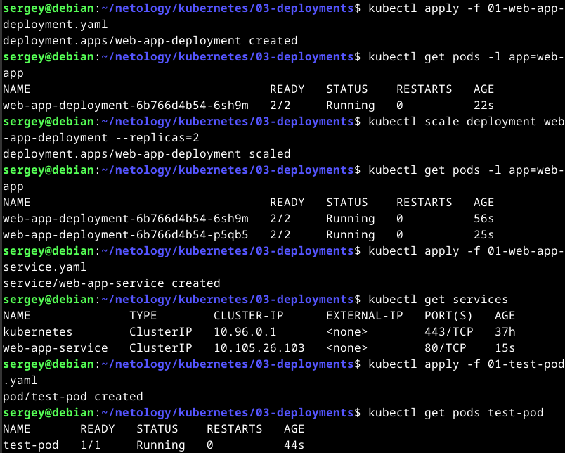
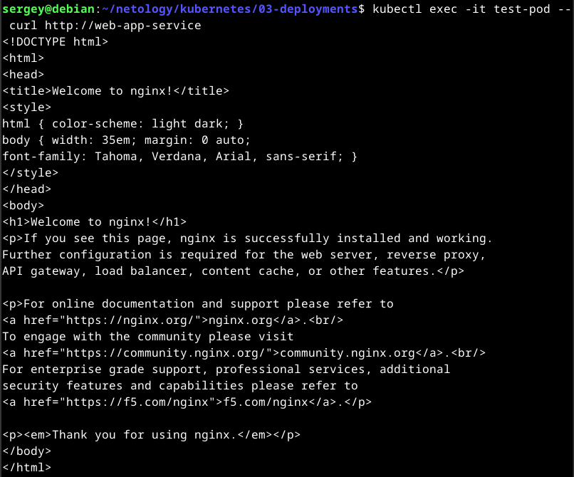
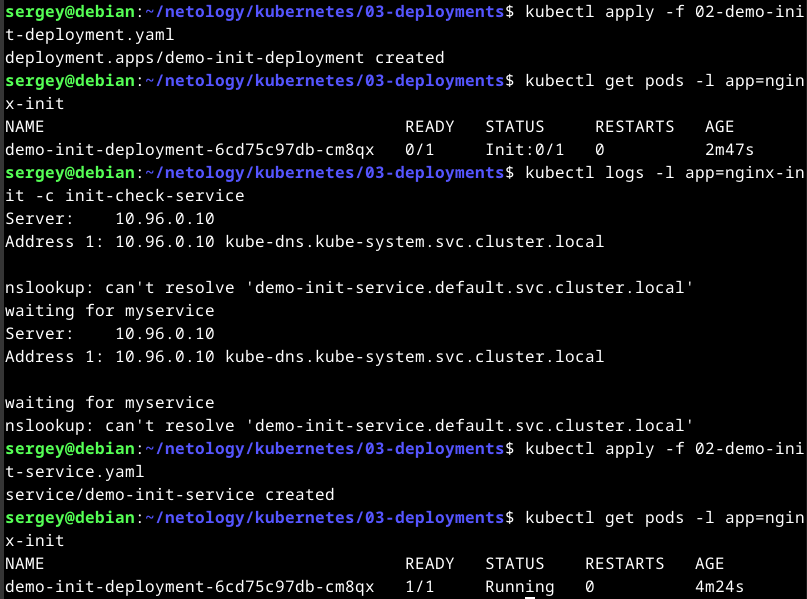

# Домашнее задание к занятию «Запуск приложений в K8S». Потапчук Сергей.

### Цель задания

В тестовой среде для работы с Kubernetes, установленной в предыдущем ДЗ, необходимо развернуть Deployment с приложением, состоящим из нескольких контейнеров, и масштабировать его.

------

### Чеклист готовности к домашнему заданию

1. Установленное k8s-решение (например, MicroK8S).
2. Установленный локальный kubectl.
3. Редактор YAML-файлов с подключённым git-репозиторием.

------

### Инструменты и дополнительные материалы, которые пригодятся для выполнения задания

1. [Описание](https://kubernetes.io/docs/concepts/workloads/controllers/deployment/) Deployment и примеры манифестов.
2. [Описание](https://kubernetes.io/docs/concepts/workloads/pods/init-containers/) Init-контейнеров.
3. [Описание](https://github.com/wbitt/Network-MultiTool) Multitool.

------

### Задание 1. Создать Deployment и обеспечить доступ к репликам приложения из другого Pod

1. Создать Deployment приложения, состоящего из двух контейнеров — nginx и multitool. Решить возникшую ошибку.
2. После запуска увеличить количество реплик работающего приложения до 2.
3. Продемонстрировать количество подов до и после масштабирования.
4. Создать Service, который обеспечит доступ до реплик приложений из п.1.
5. Создать отдельный Pod с приложением multitool и убедиться с помощью `curl`, что из пода есть доступ до приложений из п.1.

### Решение

> Конфлик в том, что оба контейнера работают на 80-м порту, роэтому один из контейнеров нужно перенастроить на работу с другим портом

Манифест Deployment (`01-web-app-deployment.yaml`)

```yaml
apiVersion: apps/v1
kind: Deployment
metadata:
  name: web-app-deployment
  labels:
    app: web-app
spec:
  replicas: 1
  selector:
    matchLabels:
      app: web-app
  template:
    metadata:
      labels:
        app: web-app
    spec:
      containers:
      - name: nginx
        image: nginx:latest
        ports:
        - containerPort: 80
      - name: multitool
        image: wbitt/network-multitool:latest
        ports:
        - containerPort: 8080
        env:
        - name: HTTP_PORT
          value: "8080" # Решаем конфликт портов: multitool будет слушать 8080
```

Манифест Service (`01-web-app-service.yaml`)

```yaml
apiVersion: v1
kind: Service
metadata:
  name: web-app-service
spec:
  selector:
    app: web-app
  ports:
    - protocol: TCP
      port: 80
      targetPort: 80
```

Манифест тестового пода (`01-test-pod.yaml`)

```yaml
apiVersion: v1
kind: Pod
metadata:
  name: test-pod
  labels:
    app: test-client
spec:
  containers:
  - name: multitool
    image: wbitt/network-multitool:latest
```

Запуск и тестирование





------

### Задание 2. Создать Deployment и обеспечить старт основного контейнера при выполнении условий

1. Создать Deployment приложения nginx и обеспечить старт контейнера только после того, как будет запущен сервис этого приложения.
2. Убедиться, что nginx не стартует. В качестве Init-контейнера взять busybox.
3. Создать и запустить Service. Убедиться, что Init запустился.
4. Продемонстрировать состояние пода до и после запуска сервиса.

### Решение

Манифест Deployment (`02-demo-init-deployment`)

```yaml
apiVersion: apps/v1
kind: Deployment
metadata:
  name: demo-init-deployment
  labels:
    app: nginx-init
spec:
  replicas: 1
  selector:
    matchLabels:
      app: nginx-init
  template:
    metadata:
      labels:
        app: nginx-init
    spec:
      initContainers:
      - name: init-check-service
        image: busybox:1.28
        command: ['sh', '-c', "until nslookup demo-init-service.default.svc.cluster.local; do echo waiting for myservice; sleep 2; done"]
      containers:
      - name: nginx
        image: nginx:latest
        ports:
        - containerPort: 80
```

Манифест Service (`02-demo-init-service.yaml`)

```yaml
apiVersion: v1
kind: Service
metadata:
  name: demo-init-service
spec:
  selector:
    app: nginx-init
  ports:
    - protocol: TCP
      port: 80
      targetPort: 80
```

Запуск и тестирование



На скриншоте видно, что почти через 3 мин. под так и не запустился, а после запуска сервиса стартовал.

------

### Правила приема работы

1. Домашняя работа оформляется в своем Git-репозитории в файле README.md. Выполненное домашнее задание пришлите ссылкой на .md-файл в вашем репозитории.
2. Файл README.md должен содержать скриншоты вывода необходимых команд `kubectl` и скриншоты результатов.
3. Репозиторий должен содержать файлы манифестов и ссылки на них в файле README.md.

------
