# Домашнее задание к занятию «Настройка приложений и управление доступом в Kubernetes». Потапчук Сергей.

### Примерное время выполнения задания

120 минут

### Цель задания

Научиться:
- Настраивать конфигурацию приложений с помощью **ConfigMaps** и **Secrets**
- Управлять доступом пользователей через **RBAC**

Это задание поможет вам освоить ключевые механизмы Kubernetes для работы с конфигурацией и безопасностью. Эти навыки необходимы для уверенного администрирования кластеров в реальных проектах. На практике навыки используются для:
- Хранения чувствительных данных (Secrets)
- Гибкого управления настройками приложений (ConfigMaps) 
- Контроля доступа пользователей и сервисов (RBAC)

------

## **Подготовка**
### **Чеклист готовности**
- Установлен Kubernetes (MicroK8S, Minikube или другой)
- Установлен `kubectl`
- Редактор для YAML-файлов (VS Code, Vim и др.)
- Утилита `openssl` для генерации сертификатов

------

### Инструменты, которые пригодятся для выполнения задания

1. [Инструкция](https://microk8s.io/docs/getting-started) по установке MicroK8S
2. [Инструкция](https://minikube.sigs.k8s.io/docs/start/) по установке Minikube
3. [Инструкция](https://kubernetes.io/docs/tasks/tools/) по установке kubectl
4. [Инструкция](https://marketplace.visualstudio.com/items?itemName=ms-kubernetes-tools.vscode-kubernetes-tools) по установке VS Code

### Дополнительные материалы, которые пригодятся для выполнения задания

1. [Описание](https://kubernetes.io/docs/concepts/configuration/secret/) Secret.
2. [Описание](https://kubernetes.io/docs/concepts/configuration/configmap/) ConfigMap.
3. [Описание](https://github.com/wbitt/Network-MultiTool) Multitool.
4. [Описание](https://kubernetes.io/docs/reference/access-authn-authz/rbac/) RBAC.
5. [Пользователи и авторизация RBAC в Kubernetes](https://habr.com/ru/company/flant/blog/470503/).
6. [RBAC with Kubernetes in Minikube](https://medium.com/@HoussemDellai/rbac-with-kubernetes-in-minikube-4deed658ea7b).

------

## **Задание 1: Работа с ConfigMaps**
### **Задача**
Развернуть приложение (nginx + multitool), решить проблему конфигурации через ConfigMap и подключить веб-страницу.

### **Шаги выполнения**
1. **Создать Deployment** с двумя контейнерами
   - `nginx`
   - `multitool`
3. **Подключить веб-страницу** через ConfigMap
4. **Проверить доступность**

### **Что сдать на проверку**
- Манифесты:
  - `deployment.yaml`
  - `configmap-web.yaml`
- Скриншот вывода `curl` или браузера

## Решение

### Манифесты

1. `configmap-web.yaml`

```yaml
apiVersion: v1
kind: ConfigMap
metadata:
  name: web-content-config
data:
  # Имя ключа станет именем файла внутри пода
  index.html: |
    <!DOCTYPE html>
    <html>
    <head>
      <title>Netology Kubernetes DZ</title>
    </head>
    <body>
      <h1>Привет от Kubernetes ConfigMap!</h1>
      <p>Эта страница загружена из ConfigMap, а не из образа Docker.</p>
    </body>
    </html>
```

2.  `deployment.yaml`

```yaml
apiVersion: apps/v1
kind: Deployment
metadata:
  name: web-app-deployment
  labels:
    app: web-app
spec:
  replicas: 1
  selector:
    matchLabels:
      app: web-app
  template:
    metadata:
      labels:
        app: web-app
    spec:
      containers:
      - name: nginx
        image: nginx:latest
        ports:
        - containerPort: 80
        volumeMounts:
        - name: html-volume
          mountPath: /usr/share/nginx/html
      - name: multitool
        image: wbitt/network-multitool:latest
        ports:
        - containerPort: 8080
        env:
        - name: HTTP_PORT
          value: "8080"
      volumes:
      - name: html-volume
        configMap:
          name: web-content-config
```

3. ` web-app-service.yaml` (создам сразу, далее `Ingress` все равно потребует сервис)

```yaml
apiVersion: v1
kind: Service
metadata:
  name: web-app-service
spec:
  type: ClusterIP
  selector:
    app: web-app
  ports:
  - name: nginx-port
    protocol: TCP
    port: 80
    targetPort: 80
```

### Проверка

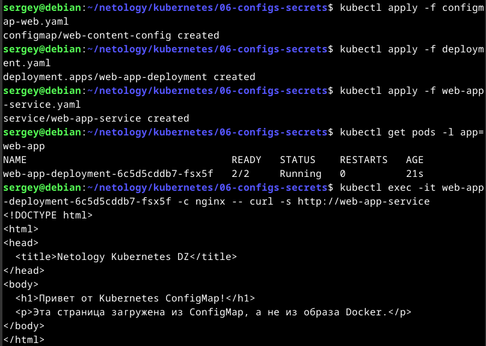

---
## **Задание 2: Настройка HTTPS с Secrets**  
### **Задача**  
Развернуть приложение с доступом по HTTPS, используя самоподписанный сертификат.

### **Шаги выполнения**  
1. **Сгенерировать SSL-сертификат**
```bash
openssl req -x509 -nodes -days 365 -newkey rsa:2048 \
  -keyout tls.key -out tls.crt -subj "/CN=myapp.example.com"
```
2. **Создать Secret**
3. **Настроить Ingress**
4. **Проверить HTTPS-доступ**

### **Что сдать на проверку**  
- Манифесты:
  - `secret-tls.yaml`
  - `ingress-tls.yaml`
- Скриншот вывода `curl -k`

## Решение

### Манифесты

1. `ingress-tls.yaml`

```yaml
apiVersion: networking.k8s.io/v1
kind: Ingress
metadata:
  name: web-app-tls-ingress
  annotations:
    nginx.ingress.kubernetes.io/rewrite-target: /
spec:
  ingressClassName: nginx
  tls:
  - hosts:
    - myapp.example.com
    secretName: myapp-tls-secret
  rules:
  - host: myapp.example.com
    http:
      paths:
      - path: /
        pathType: Prefix
        backend:
          service:
            name: web-app-service
            port:
              number: 80
```

2. `secret-tls.yaml` сгенерируем автоматически

```bash
# 1. Генерируем сертификаты (появятся tls.key и tls.crt)
openssl req -x509 -nodes -days 365 -newkey rsa:2048 \
  -keyout tls.key -out tls.crt -subj "/CN=myapp.example.com"

# 2. Генерируем манифест секрета (появится secret-tls.yaml)
kubectl create secret tls myapp-tls-secret \
  --cert=tls.crt --key=tls.key \
  --dry-run=client -o yaml > secret-tls.yaml

# 3. Проверяем, что файлы создались
ls -la tls.* secret-tls.yaml
```

### Проверка

1. Генерируем сертификаты, генерируем манифест секрета, проверяем, что файлы создались

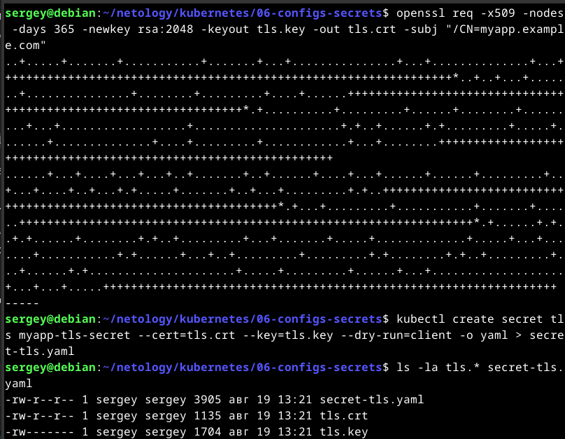

2. Применяем секрет, применяем Ingress, проверяем актуальный порт, проверяем HTTPS.

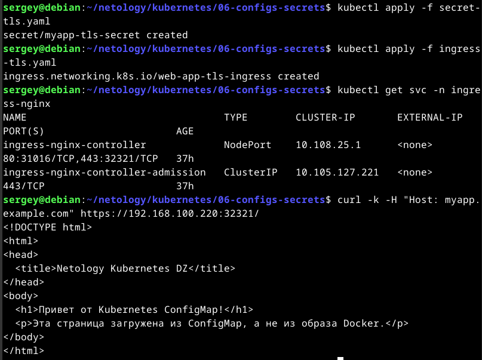

---
## **Задание 3: Настройка RBAC**  
### **Задача**  
Создать пользователя с ограниченными правами (только просмотр логов и описания подов).

### **Шаги выполнения**  
1. **Включите RBAC в microk8s**
```bash
microk8s enable rbac
```
2. **Создать SSL-сертификат для пользователя**
```bash
openssl genrsa -out developer.key 2048
openssl req -new -key developer.key -out developer.csr -subj "/CN={ИМЯ ПОЛЬЗОВАТЕЛЯ}"
openssl x509 -req -in developer.csr -CA {CA серт вашего кластера} -CAkey {CA ключ вашего кластера} -CAcreateserial -out developer.crt -days 365
```
3. **Создать Role (только просмотр логов и описания подов) и RoleBinding**
4. **Проверить доступ**

### **Что сдать на проверку**  
- Манифесты:
  - `role-pod-reader.yaml`
  - `rolebinding-developer.yaml`
- Команды генерации сертификатов
- Скриншот проверки прав (`kubectl get pods --as=developer`)

## Решение

### Манифесты

1. `role-pod-reader.yaml`

```yaml
apiVersion: rbac.authorization.k8s.io/v1
kind: Role
metadata:
  name: pod-reader-role
  namespace: default
rules:
- apiGroups: [""]
  resources: ["pods", "pods/log"]
  verbs: ["get", "list", "watch"]
# Примечание: "describe" в Kubernetes API не является отдельным глаголом (verb).
# Команда kubectl describe использует глаголы "get" и "list" под капотом.
```
2. `rolebinding-developer.yaml`

```yaml
apiVersion: rbac.authorization.k8s.io/v1
kind: RoleBinding
metadata:
  name: developer-rolebinding
  namespace: default
subjects:
- kind: User
  name: developer
  apiGroup: rbac.authorization.k8s.io
roleRef:
  kind: Role
  name: pod-reader-role
  apiGroup: rbac.authorization.k8s.io
```

### Создаем и подписываем ключ и сертификат

```bash
# 1. Генерация ключа и запроса на подпись (CSR)
openssl genrsa -out developer.key 2048
openssl req -new -key developer.key -out developer.csr -subj "/CN=developer"
```

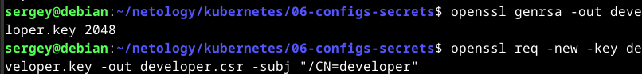

> Примечание: В поле `-subj` сертификата можно указать не только имя пользователя (CN), но и группу (O). Например, `-subj "/CN=developer/O=dev"` создаст пользователя `developer` в группе `dev`. Это позволяет давать права сразу всей группе через `kind: Group` в `RoleBinding`, что является best practice в production-окружениях. В данном задании используется только CN, так как права выдаются конкретному пользователю, а группа нигде не используется.

```bash
# 2. Подпись сертификата кластерным CA (выполнять на k8s-master с sudo!)
sudo openssl x509 -req -in developer.csr \
  -CA /etc/kubernetes/pki/ca.crt \
  -CAkey /etc/kubernetes/pki/ca.key \
  -CAcreateserial \
  -out developer.crt -days 365
```

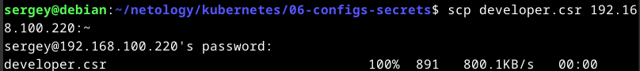

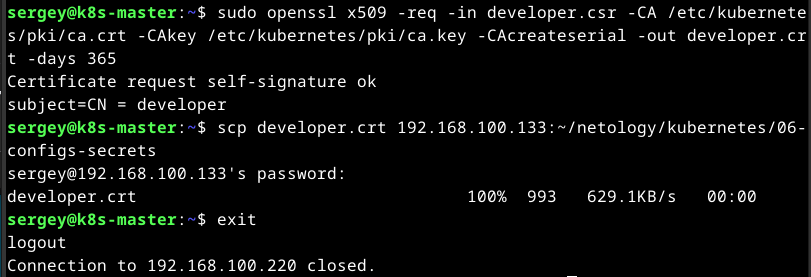

### Применяем манифесты RBAC

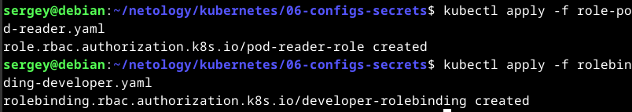

### Проверка прав (Эмуляция пользователя developer)

```bash
# Эта команда должна УСПЕШНО выполниться:
kubectl get pods --as=developer
kubectl logs <имя-любого-пода> --as=developer

# Эта команда должна ВЫДАТЬ ОШИБКУ Forbidden (так как прав на создание нет):
kubectl run test-pod --image=nginx --as=developer
```

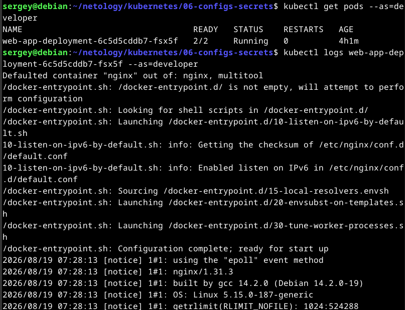

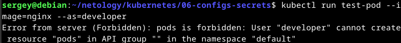

> Примечание: при использовании флага `--as=developer` `kubectl` даже не смотрит в файлы `developer.key` и `developer.crt`. Он просто просит API-сервер ***эмулировать*** пользователя по его имени (CN).

### Проверка прав "по-настоящему" с использованием ключей

```bash
# 1. Добавить пользователя developer в конфиг, указав пути к его ключам
kubectl config set-credentials developer \
  --client-certificate=/home/sergey/netology/kubernetes/06-configs-secrets/developer.crt \
  --client-key=/home/sergey/netology/kubernetes/06-configs-secrets/developer.key \
  --embed-certs=true

# 2. Создать контекст, который связывает кластер, пользователя и namespace
kubectl config set-context dev-context \
  --cluster=kubernetes \
  --user=developer \
  --namespace=default

# 3. Переключиться на этот контекст
kubectl config use-context dev-context
```

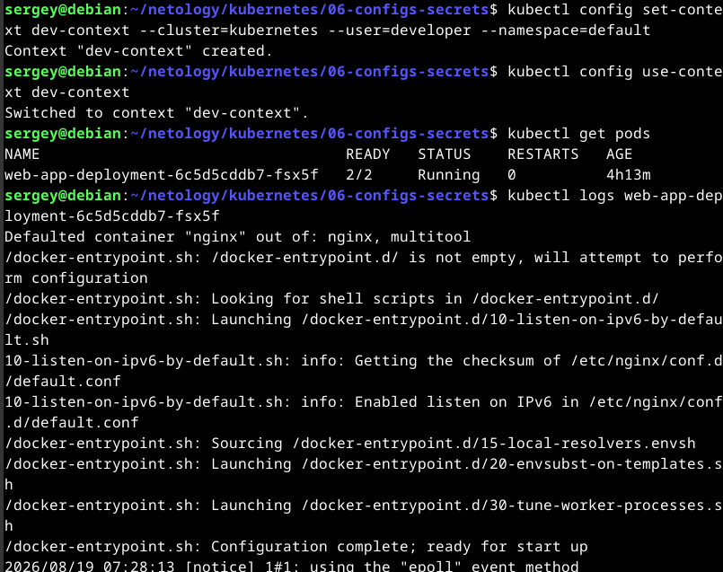

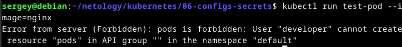

Получили аналогичный вывод, но теперь от пользователя developer с использованием ключей и сертификатов.

### Очистка контекста и конфигурации

```bash
# 1. Смотрим существующие контексты, переключаемся обратно на контекст администратора и убеждаемся, что НЕ находимся в удаляемом контексте
kubectl config get-contexts
kubectl config use-context kubernetes-admin@kubernetes
kubectl config current-context

# 2. Удаляем контекст
ubectl config delete-context dev-context

# 3. Удаляем пользователя developer из конфигурации
kubectl config delete-user developer

# 4. Проверяем, что всё чисто
kubectl config get-contexts
```

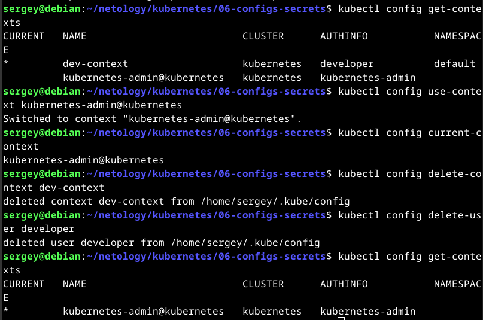

---
## Шаблоны манифестов с учебными комментариями
### **1. Deployment с ConfigMap (nginx + multitool)**
```yaml
apiVersion: apps/v1
kind: Deployment
metadata:
  name: web-app
spec:
  replicas: 1
  selector:
    matchLabels:
      app: web-app
  template:
    metadata:
      labels:
        app: web-app
    spec:
      containers:
      - name: nginx
        image: nginx:latest
        ports:
        - containerPort: 80
        volumeMounts:
        - name: nginx-config # ПОДКЛЮЧЕНИЕ ConfigMap
          mountPath: /etc/nginx/conf.d
      volumes:
      - name: nginx-config
        configMap:
          name: nginx-config # УКАЖИТЕ имя созданного ConfigMap
```
### **2. ConfigMap для веб-страницы**
```yaml
apiVersion: v1
kind: ConfigMap
metadata:
  name: web-content # ИЗМЕНИТЕ: Укажите имя ConfigMap
  namespace: default # ОПЦИОНАЛЬНО: Укажите namespace, если не default
data:
  # КЛЮЧЕВОЙ МОМЕНТ: index.html будет подключен как файл
  index.html: |
    <!DOCTYPE html>
    <html>
    <head>
      <title>Страница из ConfigMap</title> # ИЗМЕНИТЕ: Заголовок страницы
    </head>
    <body>
      <h1>Привет от Kubernetes!</h1> # ДОБАВЬТЕ: Свой контент страницы
    </body>
    </html>
```

### **3. Secret для TLS-сертификата**
```yaml
apiVersion: v1
kind: Secret
metadata:
  name: tls-secret # ИЗМЕНИТЕ при необходимости
type: kubernetes.io/tls
data:
  tls.crt: # ЗАМЕНИТЕ на base64-код сертификата (cat tls.crt | base64 -w 0)
  tls.key: # ЗАМЕНИТЕ на base64-код ключа (cat tls.key | base64 -w 0)
```
### **4. Role для просмотра подов**
```yaml
apiVersion: rbac.authorization.k8s.io/v1
kind: Role
metadata:
  name: pod-viewer # ИЗМЕНИТЕ: Название роли
  namespace: default # ВАЖНО: Role работает только в указанном namespace
rules:
- apiGroups: [""] # КЛЮЧЕВОЙ МОМЕНТ: "" означает core API group
  resources: # РАЗРЕШЕННЫЕ РЕСУРСЫ:
    - pods # Доступ к просмотру подов
    - pods/log # Доступ к логам подов
  verbs: # РАЗРЕШЕННЫЕ ДЕЙСТВИЯ:
    - get # Просмотр отдельных подов
    - list # Список всех подов
    - watch # Мониторинг изменений
    - describe # Просмотр деталей
# ДОПОЛНИТЕЛЬНО: Можно добавить больше правил для других ресурсов
```
---

## **Правила приёма работы**
1. Домашняя работа оформляется в своём Git-репозитории в файле README.md. Выполненное домашнее задание пришлите ссылкой на .md-файл в вашем репозитории.
2. Файл README.md должен содержать:
   - Скриншоты вывода команд `kubectl`
   - Скриншоты результатов выполнения
   - Тексты манифестов или ссылки на них
3. Для заданий с TLS приложите команды генерации сертификатов

## **Критерии оценивания задания**
1. Зачёт: Все задачи выполнены, манифесты корректны, есть доказательства работы (скриншоты).
2. Доработка (на доработку задание направляется 1 раз): основные задачи выполнены, при этом есть ошибки в манифестах или отсутствуют проверочные скриншоты.
3. Незачёт: работа выполнена не в полном объёме, есть ошибки в манифестах, отсутствуют проверочные скриншоты. Все попытки доработки израсходованы (на доработку работа направляется 1 раз). Этот вид оценки используется крайне редко.

## **Срок выполнения задания**  
1. 5 дней на выполнение задания.
2. 5 дней на доработку задания (в случае направления задания на доработку).
