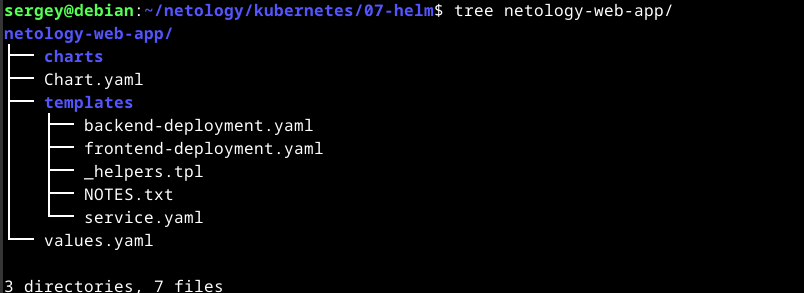
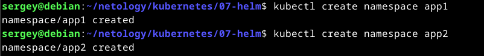
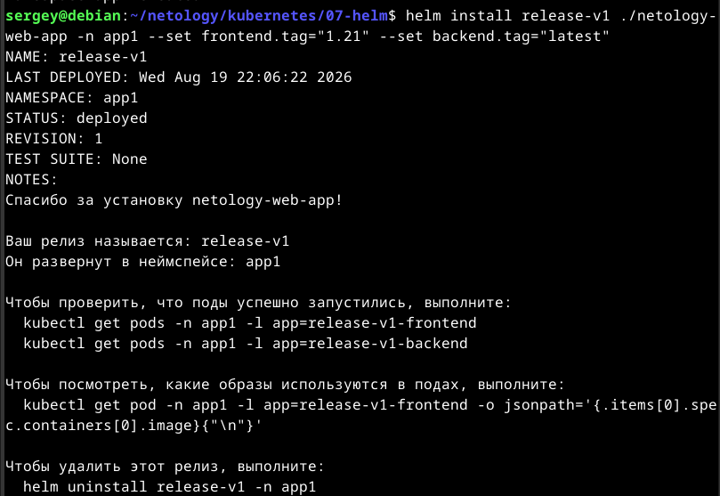
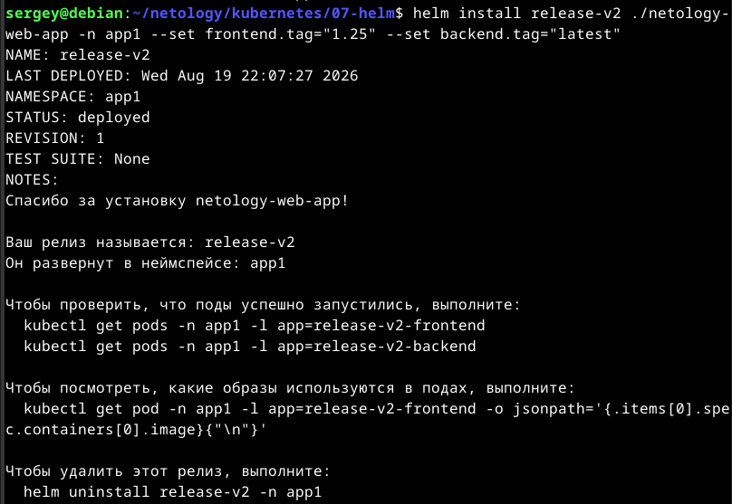
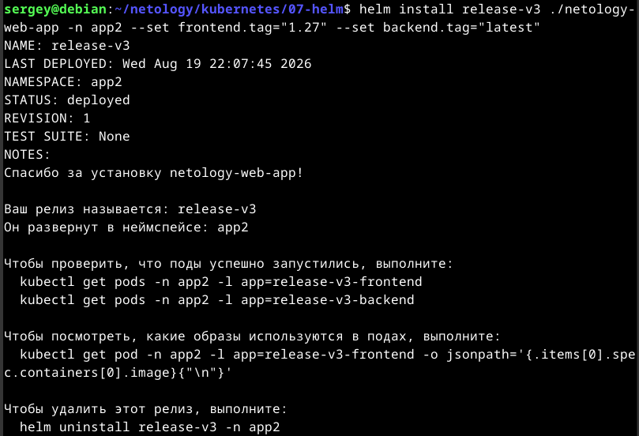
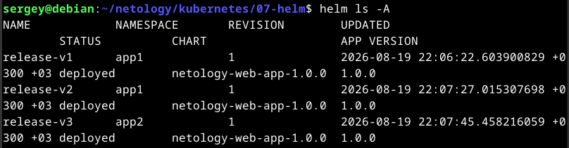
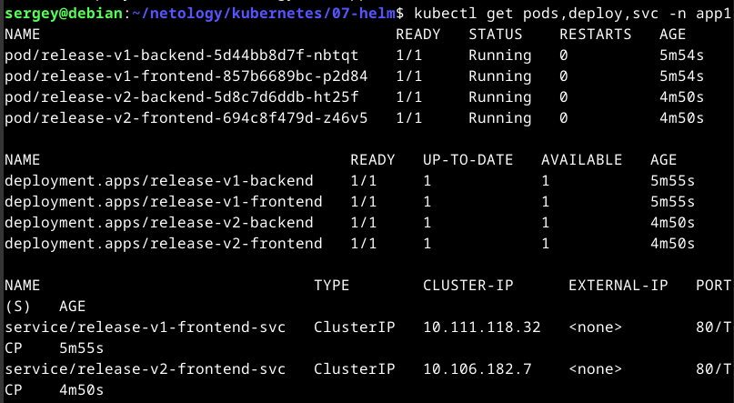
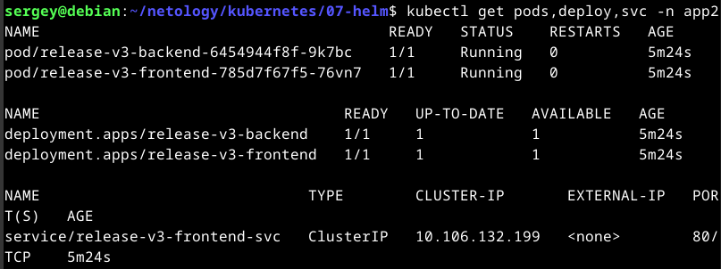
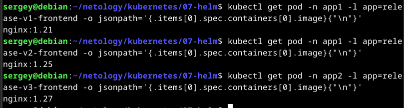

# Домашнее задание к занятию «Helm». Потапчук Сергей.

### Цель задания

В тестовой среде Kubernetes необходимо установить и обновить приложения с помощью Helm.

------

### Чеклист готовности к домашнему заданию

1. Установленное k8s-решение, например, MicroK8S.
2. Установленный локальный kubectl.
3. Установленный локальный Helm.
4. Редактор YAML-файлов с подключенным репозиторием GitHub.

------

### Инструменты и дополнительные материалы, которые пригодятся для выполнения задания

1. [Инструкция](https://helm.sh/docs/intro/install/) по установке Helm. [Helm completion](https://helm.sh/docs/helm/helm_completion/).

------

### Как я устанавливал Helm

```bash
# 1. Скачиваем официальный установочный скрипт Helm
curl -fsSL -o get_helm.sh https://raw.githubusercontent.com/helm/helm/main/scripts/get-helm-3

# 1'. Если curl выдаст ошибку SSL, используйте wget
wget https://raw.githubusercontent.com/helm/helm/main/scripts/get-helm-3 -O get_helm.sh

# 2. Делаем скрипт исполняемым
chmod 700 get_helm.sh

# 3. Запускаем установку (скрипт сам определит вашу архитектуру amd64 и скачает нужную версию)
./get_helm.sh

# 4. Проверяем успешную установку
helm version
```

------

### Задание 1. Подготовить Helm-чарт для приложения

1. Необходимо упаковать приложение в чарт для деплоя в разные окружения. 
2. Каждый компонент приложения деплоится отдельным deployment’ом или statefulset’ом.
3. В переменных чарта измените образ приложения для изменения версии.

### Решение

```bash
helm create netology-web-app
```

1. `netology-web-app/values.yaml`

```yaml
# netology-web-app/values.yaml
frontend:
  name: frontend
  image: nginx
  tag: "1.21" # Версия по умолчанию (будет переопределена при install)
  port: 80

backend:
  name: backend
  image: wbitt/network-multitool
  tag: "latest"
  port: 8080

service:
  type: ClusterIP
```

2. `netology-web-app/templates/frontend-deployment.yaml`

```yaml
# netology-web-app/templates/frontend-deployment.yaml
apiVersion: apps/v1
kind: Deployment
metadata:
  name: {{ .Release.Name }}-frontend
  labels:
    app: {{ .Release.Name }}-frontend
spec:
  replicas: 1
  selector:
    matchLabels:
      app: {{ .Release.Name }}-frontend
  template:
    metadata:
      labels:
        app: {{ .Release.Name }}-frontend
    spec:
      containers:
      - name: frontend
        image: "{{ .Values.frontend.image }}:{{ .Values.frontend.tag }}"
        ports:
        - containerPort: {{ .Values.frontend.port }}
```

3. `netology-web-app/templates/backend-deployment.yaml`

```yaml
# netology-web-app/templates/backend-deployment.yaml
apiVersion: apps/v1
kind: Deployment
metadata:
  name: {{ .Release.Name }}-backend
  labels:
    app: {{ .Release.Name }}-backend
spec:
  replicas: 1
  selector:
    matchLabels:
      app: {{ .Release.Name }}-backend
  template:
    metadata:
      labels:
        app: {{ .Release.Name }}-backend
    spec:
      containers:
      - name: backend
        image: "{{ .Values.backend.image }}:{{ .Values.backend.tag }}"
        ports:
        - containerPort: {{ .Values.backend.port }}
```

4. `netology-web-app/templates/service.yaml`

```yaml
# netology-web-app/templates/service.yaml
apiVersion: v1
kind: Service
metadata:
  name: {{ .Release.Name }}-frontend-svc
spec:
  type: {{ .Values.service.type }}
  selector:
    app: {{ .Release.Name }}-frontend
  ports:
    - protocol: TCP
      port: {{ .Values.frontend.port }}
      targetPort: {{ .Values.frontend.port }}
```



------

### Задание 2. Запустить две версии в разных неймспейсах

1. Подготовив чарт, необходимо его проверить. Запуститe несколько копий приложения.
2. Одну версию в namespace=app1, вторую версию в том же неймспейсе, третью версию в namespace=app2.
3. Продемонстрируйте результат.

### Решение

#### Создаем неймспейсы

```yaml
kubectl create namespace app1
kubectl create namespace app2
```



#### Версия 1.21 в app1

```yaml
helm install release-v1 ./netology-web-app -n app1 \
  --set frontend.tag="1.21" \
  --set backend.tag="latest"
```



#### Версия 1.25 в app1

```yaml
helm install release-v2 ./netology-web-app -n app1 \
  --set frontend.tag="1.25" \
  --set backend.tag="latest"
```



#### Версия 1.27 в app2

```yaml
helm install release-v3 ./netology-web-app -n app2 \
  --set frontend.tag="1.27" \
  --set backend.tag="latest"
```



#### Смотрим все установленные релизы во всех неймспейсах

```yaml
helm ls -A
```



#### Смотрим ресурсы в namespace-ах

```yaml
kubectl get pods,deploy,svc -n app1
kubectl get pods,deploy,svc -n app2
```





#### Проверка версий образов

```yaml
# Проверка версии в app1 (release-v1)
kubectl get pod -n app1 -l app=release-v1-frontend -o jsonpath='{.items[0].spec.containers[0].image}{"\n"}'

# Проверка версии в app1 (release-v2)
kubectl get pod -n app1 -l app=release-v2-frontend -o jsonpath='{.items[0].spec.containers[0].image}{"\n"}'

# Проверка версии в app2 (release-v3)
kubectl get pod -n app2 -l app=release-v3-frontend -o jsonpath='{.items[0].spec.containers[0].image}{"\n"}'
```



------

### Правила приёма работы

1. Домашняя работа оформляется в своём Git репозитории в файле README.md. Выполненное домашнее задание пришлите ссылкой на .md-файл в вашем репозитории.
2. Файл README.md должен содержать скриншоты вывода необходимых команд `kubectl`, `helm`, а также скриншоты результатов.
3. Репозиторий должен содержать тексты манифестов или ссылки на них в файле README.md.
