# Домашнее задание к занятию «Установка Kubernetes». Потапчук Сергей.

### Цель задания

Установить кластер K8s.

### Чеклист готовности к домашнему заданию

1. Развёрнутые ВМ с ОС Ubuntu 20.04-lts.


### Инструменты и дополнительные материалы, которые пригодятся для выполнения задания

1. [Инструкция по установке kubeadm](https://kubernetes.io/docs/setup/production-environment/tools/kubeadm/create-cluster-kubeadm/).
2. [Документация kubespray](https://kubespray.io/).

-----

### Задание 1. Установить кластер k8s с 1 master node

1. Подготовка работы кластера из 5 нод: 1 мастер и 4 рабочие ноды.
2. В качестве CRI — containerd.
3. Запуск etcd производить на мастере.
4. Способ установки выбрать самостоятельно.

### Решение

Создавать буду сразу HA кластер (Задание 2*)

------

## Дополнительные задания (со звёздочкой)

**Настоятельно рекомендуем выполнять все задания под звёздочкой.** Их выполнение поможет глубже разобраться в материале.   
Задания под звёздочкой необязательные к выполнению и не повлияют на получение зачёта по этому домашнему заданию. 

------

### Задание 2*. Установить HA кластер

1. Установить кластер в режиме HA.
2. Использовать нечётное количество Master-node.
3. Для cluster ip использовать keepalived или другой способ.

### Решение

#### Скрипт создания ВМ и cloud-config файлы.

1. `k8s-master-user-data.tpl` (cloud-config master-node)

```yaml
#cloud-config
hostname: ${HOSTNAME}

package_update: true
package_upgrade: true

packages:
  - apt-transport-https
  - ca-certificates
  - curl
  - gnupg
  - containerd
  - qemu-guest-agent
  - keepalived
  - haproxy

write_files:
  - path: /etc/modules-load.d/k8s.conf
    content: |
      overlay
      br_netfilter

  - path: /etc/sysctl.d/k8s.conf
    content: |
      net.bridge.bridge-nf-call-iptables  = 1
      net.bridge.bridge-nf-call-ip6tables = 1
      net.ipv4.ip_forward                 = 1

  - path: /etc/containerd/config.toml
    content: |
      version = 2
      [plugins."io.containerd.grpc.v1.cri".containerd]
        snapshotter = "overlayfs"
        [plugins."io.containerd.grpc.v1.cri".containerd.runtimes.runc]
          runtime_type = "io.containerd.runc.v2"
          [plugins."io.containerd.grpc.v1.cri".containerd.runtimes.runc.options]
            SystemdCgroup = true

  - path: /etc/keepalived/keepalived.conf
    content: |
      vrrp_script check_apiserver {
        script "/usr/bin/curl -k --silent https://localhost:6443/healthz > /dev/null"
        interval 3
        weight -2
        fall 10
        rise 2
      }

      vrrp_instance VI_1 {
          state ${KEEPALIVED_STATE}
          interface ${INTERFACE_NAME}
          virtual_router_id 51
          priority ${KEEPALIVED_PRIORITY}
          authentication {
              auth_type PASS
              auth_pass secret
          }
          virtual_ipaddress {
              ${VIP_ADDRESS}
          }
          track_script {
              check_apiserver
          }
      }

  - path: /etc/haproxy/haproxy.cfg
    content: |
      global
          log /dev/log local0
          log /dev/log local1 notice
          chroot /var/lib/haproxy
          stats socket /run/haproxy/admin.sock mode 660 level admin expose-fd listeners
          stats timeout 30s
          user haproxy
          group haproxy
          daemon

      defaults
          log global
          mode tcp
          option tcplog
          option dontlognull
          timeout connect 5000
          timeout client 50000
          timeout server 50000

      frontend kubernetes-apiserver
          bind *:8443
          mode tcp
          option tcplog
          default_backend kubernetes-apiserver

      backend kubernetes-apiserver
          mode tcp
          option tcp-check
          balance roundrobin
          server k8s-master-1 ${MASTER1_IP}:6443 check
          server k8s-master-2 ${MASTER2_IP}:6443 check
          server k8s-master-3 ${MASTER3_IP}:6443 check

  - path: /etc/default/kubelet
    content: |
      KUBELET_EXTRA_ARGS=--node-ip=${NODE_IP}

runcmd:
  - modprobe overlay
  - modprobe br_netfilter
  - sysctl --system
  - swapoff -a
  - sed -i '/swap/d' /etc/fstab
  - systemctl daemon-reload
  - systemctl enable --now containerd
  - systemctl enable --now keepalived
  - systemctl enable --now haproxy
  
  # Установка Kubernetes с обходом строгой проверки GPG в Debian 13
  - curl -fsSL https://pkgs.k8s.io/core:/stable:/v1.36/deb/Release.key | gpg --dearmor -o /etc/apt/keyrings/kubernetes-apt-keyring.gpg
  - echo 'deb [trusted=yes] https://pkgs.k8s.io/core:/stable:/v1.36/deb/ /' > /etc/apt/sources.list.d/kubernetes.list
  - apt-get update
  - apt-get install -y kubelet kubeadm kubectl
  - apt-mark hold kubelet kubeadm kubectl

users:
  - name: sergey
    sudo: ALL=(ALL) NOPASSWD:ALL
    groups: users, sudo
    shell: /bin/bash
    lock_passwd: false
    passwd: 12345678
    ssh_authorized_keys:
      - ${SSH_KEY}
```

2. `k8s-worker-user-data.tpl` (cloud-config worker-node)

```yaml
#cloud-config
hostname: ${HOSTNAME}

package_update: true
package_upgrade: true

packages:
  - apt-transport-https
  - ca-certificates
  - curl
  - gnupg
  - containerd
  - qemu-guest-agent

write_files:
  - path: /etc/modules-load.d/k8s.conf
    content: |
      overlay
      br_netfilter

  - path: /etc/sysctl.d/k8s.conf
    content: |
      net.bridge.bridge-nf-call-iptables  = 1
      net.bridge.bridge-nf-call-ip6tables = 1
      net.ipv4.ip_forward                 = 1

  - path: /etc/containerd/config.toml
    content: |
      version = 2
      [plugins."io.containerd.grpc.v1.cri".containerd]
        snapshotter = "overlayfs"
        [plugins."io.containerd.grpc.v1.cri".containerd.runtimes.runc]
          runtime_type = "io.containerd.runc.v2"
          [plugins."io.containerd.grpc.v1.cri".containerd.runtimes.runc.options]
            SystemdCgroup = true

  - path: /etc/default/kubelet
    content: |
      KUBELET_EXTRA_ARGS=--node-ip=${NODE_IP}

runcmd:
  - modprobe overlay
  - modprobe br_netfilter
  - sysctl --system
  - swapoff -a
  - sed -i '/swap/d' /etc/fstab
  - systemctl daemon-reload
  - systemctl enable --now containerd
  
  # Установка Kubernetes с обходом строгой проверки GPG в Debian 13
  - curl -fsSL https://pkgs.k8s.io/core:/stable:/v1.36/deb/Release.key | gpg --dearmor -o /etc/apt/keyrings/kubernetes-apt-keyring.gpg
  - echo 'deb [trusted=yes] https://pkgs.k8s.io/core:/stable:/v1.36/deb/ /' > /etc/apt/sources.list.d/kubernetes.list
  - apt-get update
  - apt-get install -y kubelet kubeadm kubectl
  - apt-mark hold kubelet kubeadm kubectl

users:
  - name: sergey
    sudo: ALL=(ALL) NOPASSWD:ALL
    groups: users, sudo
    shell: /bin/bash
    lock_passwd: false
    passwd: 12345678
    ssh_authorized_keys:
      - ${SSH_KEY}
```

3. `create-ha-cluster.sh` (скрипт создания ВМ)

```yaml
#!/bin/bash
set -e

# Проверка root-прав
if [ "$EUID" -ne 0 ]; then
  echo "Запустите: sudo $0"
  exit 1
fi

# === КОНФИГУРАЦИЯ ===
REAL_USER="${SUDO_USER:-$USER}"
SSH_KEY=$(cat "/home/$REAL_USER/.ssh/id_rsa.pub")
SSH_KEY_PATH="/home/$REAL_USER/.ssh/id_rsa.pub"
BRIDGE="br0"

SCRIPT_DIR="$(cd "$(dirname "$0")" && pwd)"
VM_DIR="/var/lib/libvirt/images"
BASE_IMG="$VM_DIR/debian-13-generic-amd64-daily.qcow2"
VM_TPL="$VM_DIR/k8s-base-template.qcow2"
DISK_SIZE="10G"
MASTER_TPL="$SCRIPT_DIR/k8s-master-user-data.tpl"
WORKER_TPL="$SCRIPT_DIR/k8s-worker-user-data.tpl"

# Сетевая конфигурация
GATEWAY="192.168.100.1"
VIP_ADDRESS="192.168.100.160"

# === ПРОВЕРКИ ===
if [ ! -f "$SSH_KEY_PATH" ]; then
  echo "❌ SSH-ключ не найден: $SSH_KEY"
  exit 1
fi

# Создаём шаблон, если его нет
if [ ! -f "$VM_TPL" ]; then
  echo "=== Создание шаблона $VM_TPL ==="
  qemu-img create -f qcow2 -b "$BASE_IMG" -F qcow2 "$VM_TPL" "$DISK_SIZE"
  echo "✅ Шаблон создан"
  echo ""
fi

if [ ! -f "$MASTER_TPL" ]; then
  echo "❌ Шаблон $MASTER_TPL не найден"
  exit 1
fi

if [ ! -f "$WORKER_TPL" ]; then
  echo "❌ Шаблон $WORKER_TPL не найден"
  exit 1
fi

mkdir -p "$VM_DIR"

# Массив ВМ: "имя:роль:RAM:vCPU:IP:keepalived_state:keepalived_priority"
VMS=(
  "k8s-ha-master-1:master:4096:2:192.168.100.161:BACKUP:100"
  "k8s-ha-master-2:master:4096:2:192.168.100.162:BACKUP:90"
  "k8s-ha-master-3:master:4096:2:192.168.100.163:BACKUP:80"
  "k8s-ha-worker-1:worker:2048:2:192.168.100.164"
  "k8s-ha-worker-2:worker:2048:2:192.168.100.165"
  "k8s-ha-worker-3:worker:2048:2:192.168.100.166"
  "k8s-ha-worker-4:worker:2048:2:192.168.100.167"
)

for entry in "${VMS[@]}"; do
  IFS=':' read -r NAME ROLE RAM VCPU STATIC_IP KEEPALIVED_STATE KEEPALIVED_PRIORITY <<< "$entry"
  VM_DISK="$VM_DIR/${NAME}.qcow2"
  USER_DATA="$VM_DIR/${NAME}-user-data"
  META_DATA="$VM_DIR/${NAME}-meta-data"
  
  echo "=== Создание ВМ: $NAME ($ROLE) IP=$STATIC_IP ==="
  
  # Создаём диск
  qemu-img create -f qcow2 -b "$VM_TPL" -F qcow2 "$VM_DISK"
  
  # Экспортируем переменные для envsubst
  export HOSTNAME="$NAME"
  export SSH_KEY
  export STATIC_IP
  export GATEWAY
  export NODE_IP="$STATIC_IP"
  export VIP_ADDRESS
  export INTERFACE_NAME="enp1s0"
  export MASTER1_IP="192.168.100.161"
  export MASTER2_IP="192.168.100.162"
  export MASTER3_IP="192.168.100.163"
  
  if [ "$ROLE" = "master" ]; then
    export KEEPALIVED_STATE
    export KEEPALIVED_PRIORITY
    envsubst < "$MASTER_TPL" > "$USER_DATA"
  else
    envsubst < "$WORKER_TPL" > "$USER_DATA"
  fi
  
  echo "instance-id: ${NAME}" > "$META_DATA"

  # Создаём network-config
  NETWORK_CONFIG="$VM_DIR/${NAME}-network-config"
  cat > "$NETWORK_CONFIG" << EOF
version: 2
renderer: networkd
ethernets:
  enp1s0:
    dhcp4: false
    addresses:
      - ${STATIC_IP}/24
    gateway4: ${GATEWAY}
    nameservers:
      addresses: [8.8.8.8, 1.1.1.1]
EOF

  # Создаём ВМ
  virt-install \
    --name "$NAME" \
    --memory "$RAM" \
    --vcpus "$VCPU" \
    --disk path="$VM_DISK",format=qcow2 \
    --import \
    --os-variant debian11 \
    --network bridge="$BRIDGE",model=virtio \
    --cloud-init user-data="$USER_DATA",meta-data="$META_DATA",network-config="$NETWORK_CONFIG" \
    --graphics spice \
    --video virtio \
    --noautoconsole
  
  echo "✅ ВМ $NAME создана с IP $STATIC_IP"
  echo "   Диск: $VM_DISK"
  echo ""
done

echo "=== Все ВМ созданы! ==="
echo "Ожидайте 3-5 минут, пока cloud-init завершит установку..."
```

#### Запуск скрипта для создания всех ВМ кластера

```bash
sudo ./create-ha-cluster.sh
```

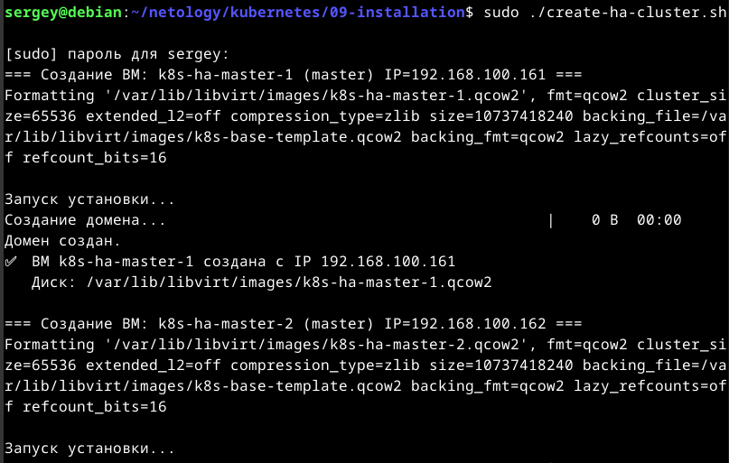

#### Проверка создания ВМ

```bash
sudo virsh list | grep "k8s-ha"
```

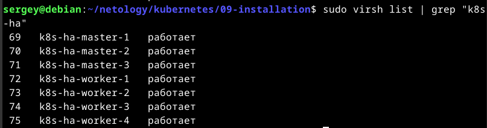

#### Проверка доступность всех нод

```bash
for i in 160 161 162 163 164 165 166 167; do
  echo -n "192.168.100.$i: "
  ping -c 1 -W 1 192.168.100.$i > /dev/null 2>&1 && echo "OK" || echo "FAIL"
done
```

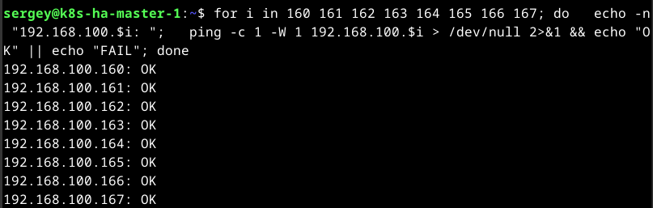

#### Проверка работоспособности `HAProxy` и `Keepalived`

```bash
for i in 161 162 163; do
  echo "=== 192.168.100.$i ==="
  sshpass -p '12345678' ssh -o StrictHostKeyChecking=no sergey@192.168.100.$i \
    "sudo systemctl is-active keepalived haproxy && ip addr show enp1s0 | grep 'inet ' | head -2"
done
```

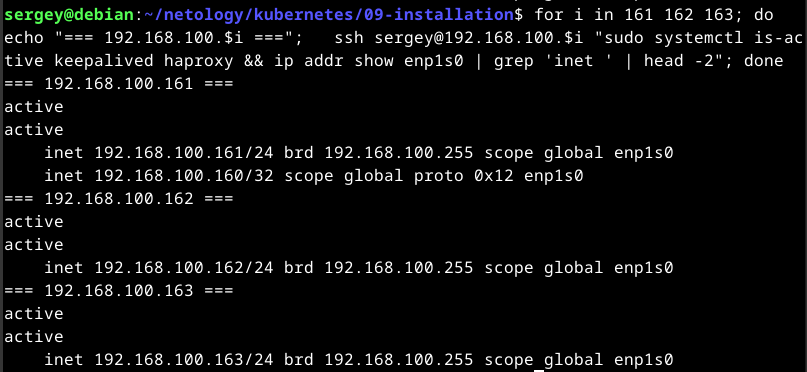

#### Инициализация `control-plane` с `VIP`

```bash
sudo kubeadm init \
  --control-plane-endpoint="192.168.100.160:8443" \
  --upload-certs \
  --pod-network-cidr=10.244.0.0/16 \
  --apiserver-advertise-address=192.168.100.161
```

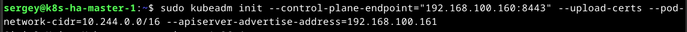

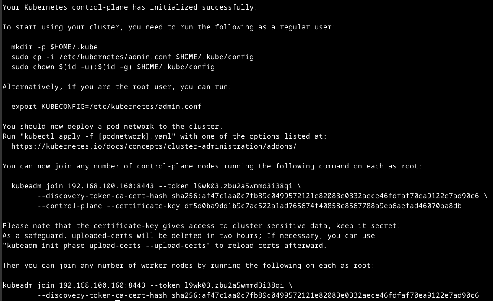

#### Настройка `kubectl` (можно на каждой master-node)

```bash
mkdir -p $HOME/.kube
sudo cp -i /etc/kubernetes/admin.conf $HOME/.kube/config
sudo chown $(id -u):$(id -g) $HOME/.kube/config
# Настройка автодополнения
echo 'source <(kubectl completion bash)' >> ~/.bashrc
source ~/.bashrc
```

#### Проверка состояния нод

```bash
kubectl get nodes
```

#### Установка `CNI` (`Flannel`)

```bash
kubectl apply -f https://github.com/flannel-io/flannel/releases/latest/download/kube-flannel.yml
```

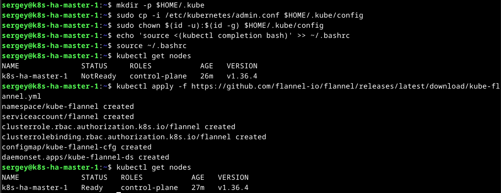

#### Присоединение остальных `master-node`

```bash
# Используйте команду из вывода kubeadm init с флагами --control-plane и --certificate-key
sudo kubeadm join 192.168.100.160:8443 \
  --token <token> \
  --discovery-token-ca-cert-hash sha256:<hash> \
  --control-plane \
  --certificate-key <key>
```

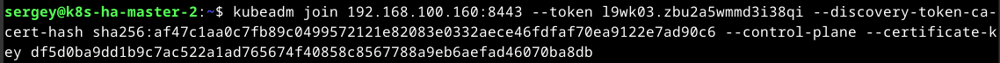

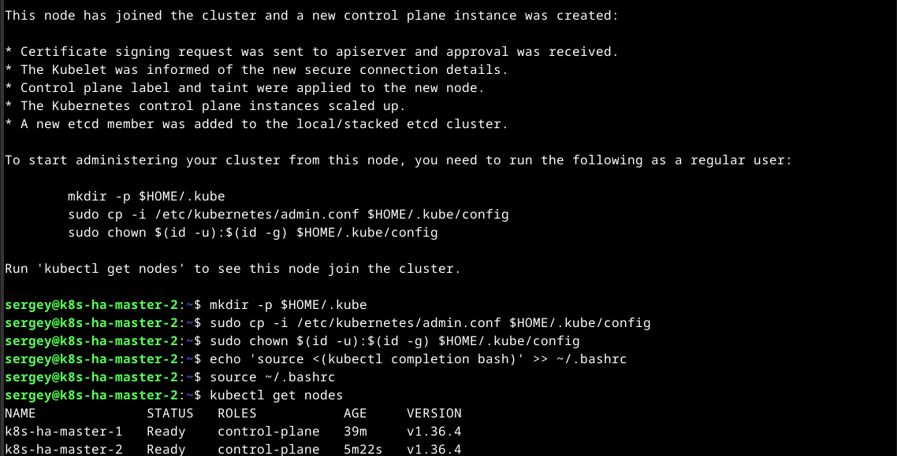

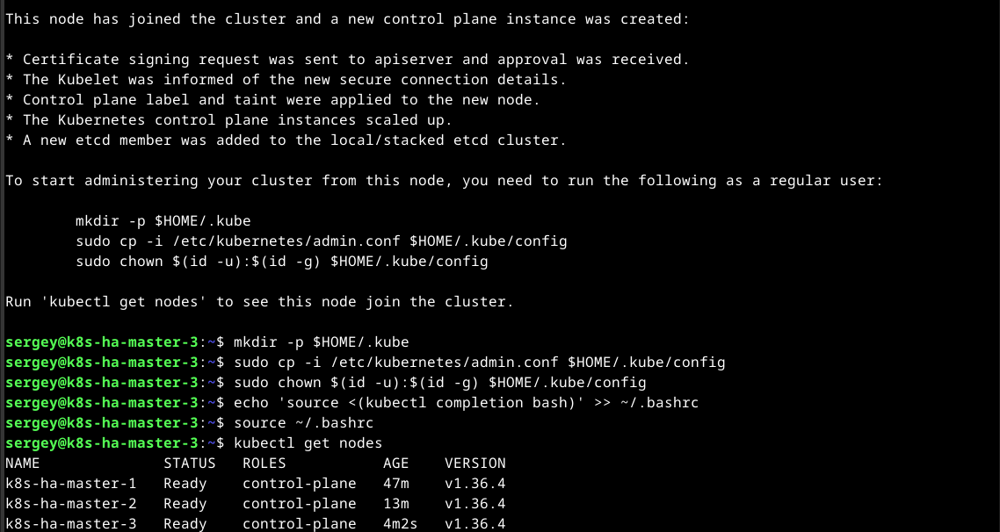

#### Присоедините `worker-node`

```bash
# Используйте команду из вывода kubeadm init (без --control-plane)
sudo kubeadm join 192.168.100.160:8443 \
  --token <token> \
  --discovery-token-ca-cert-hash sha256:<hash>
```

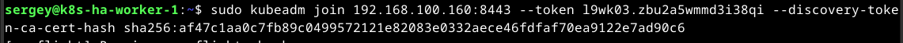

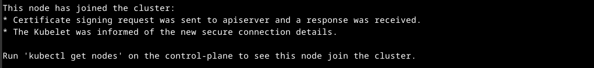

#### Проверка кластера

```bash
kubectl get nodes
kubectl get pods -A
```

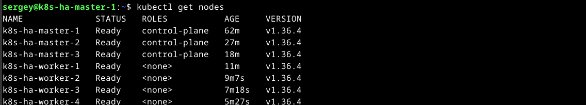

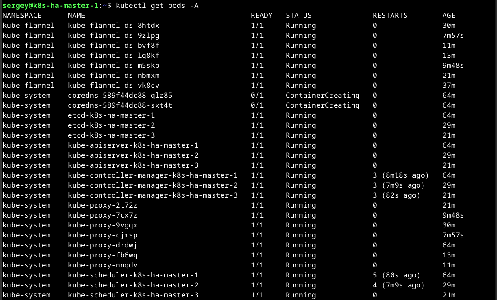

------

### Правила приёма работы

1. Домашняя работа оформляется в своем Git-репозитории в файле README.md. Выполненное домашнее задание пришлите ссылкой на .md-файл в вашем репозитории.
2. Файл README.md должен содержать скриншоты вывода необходимых команд `kubectl get nodes`, а также скриншоты результатов.
3. Репозиторий должен содержать тексты манифестов или ссылки на них в файле README.md.
